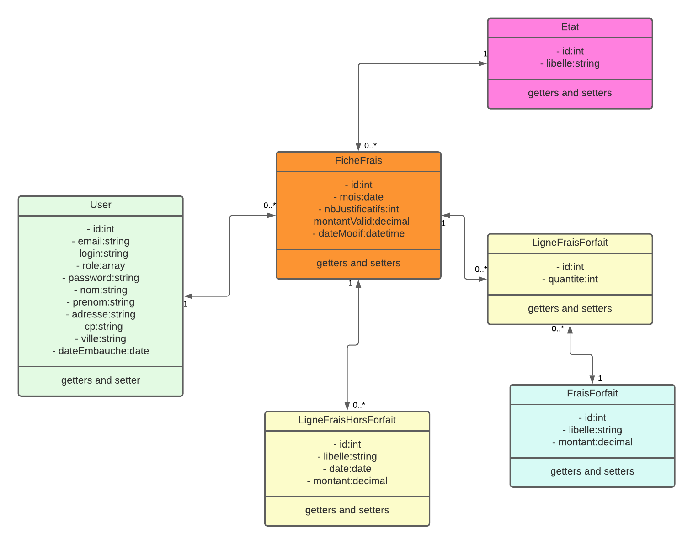

# GSB - Frais

## Contexte du projet

Ce projet s'inscrit dans le cadre de l'épreuve E6 du BTS SIO (option SLAM). Il consiste en la conception et le développement d'une application web de gestion de frais professionnels pour le laboratoire pharmaceutique Galaxy Swiss Bourdin (GSB).

L'objectif est de **moderniser**, **standardiser** et **sécuriser** la gestion des frais des visiteurs médicaux.

- **Période de réalisation :** Septembre 2024 – Avril 2025
- **Lieu :** Osint Friendly
- **Modalité :** Projet individuel

## Compétences travaillées

- Concevoir et développer une solution applicative.
- Gérer des données.
- Assurer la maintenance corrective ou évolutive d'une solution applicative.

## Objectifs principaux

- **Standardiser** la gestion des frais.
- **Remplacer** les anciens systèmes papiers et logiciels obsolètes.
- **Garantir** un suivi fiable des remboursements.
- **Faciliter** la gestion des frais pour les visiteurs médicaux et le service comptable.

## Fonctionnalités principales

### Pour les visiteurs médicaux :
- Authentification sécurisée.
- Saisie et modification des frais (forfaitisés et hors forfait) chaque mois.
- Consultation de l'état de remboursement sur une période d'un an.

### Pour le service comptable :
- Validation mensuelle des frais soumis.
- Modification et suppression des frais non valides.
- Traitement des paiements et suivi des remboursements.

## Ressources et environnement

- **Framework :** Symfony (PHP)
- **Architecture :** MVC (Modèle-Vue-Contrôleur)
- **Base de données :** MySQL
- **Serveur de développement :** Symfony CLI
- **Version de PHP recommandée :** ≥ 8.1

## Installation du projet

1. **Cloner le dépôt :**
```bash
git clone https://github.com/Bili-and-sheep/GSB.git
cd GSB
```

2. **Configurer les variables d'environnement :**
```bash
nano .env.local
```

3. **Installer les dépendances :**
```bash
composer install
```

4. **Configurer la base de données :**
```bash
php bin/console doctrine:database:create
php bin/console doctrine:schema:update --force
```

5. **Démarrer le serveur :**
```bash
symfony serve -d
```

6. **Accéder à l'application :**
   [http://localhost:8000](http://localhost:8000)

## Mise en place initiale

1. **Importer les données :**
   - Rendez-vous sur la route `/import` ou via la section « BigBoy » dans le menu.
   - Cliquer sur les boutons dans l'ordre indiqué pour importer toutes les données.

2. **Modifier les utilisateurs par défaut :**
   - Accéder à `/user` pour modifier les rôles des utilisateurs.
   #### Rôles utilisateurs
   - **Visiteur médical** (`ROLE_VISITEUR`) : saisie et consultation des frais.
   - **Comptable** (`ROLE_COMPTABLE`) : validation, correction et traitement des frais.
   
   #### Utilisateur de démo :
      - **Email :** `villechalane.louis@gsb.fr`
      - **Mot de passe :** `jux7g`

3. **Connexion à l'application :**
   - Se connecter à `/login` avec un compte ayant les rôles adaptés.

> **Attention :** sans les bons rôles, certaines parties de l'application ne seront pas accessibles.

## Structure du projet

```
GSB/
├── config/         # Configuration Symfony
├── src/            # Contrôleurs, entités, services
├── templates/      # Vues Twig
├── migrations/     # Migrations Doctrine
├── public/         # Ressources publiques
├── tests/          # Tests unitaires et fonctionnels
├── assets/         # Fichiers frontend
```

## Détail complet des routes de l'application (avec accès global et sécurité)

---

### ComptableController.php

- 🔑 Accès global : `ROLE_COMPTABLE`
- 🔒 Sécurisé : Authentification requise

**Routes :**
- **GET** `/comptable/fiche`  
  📄 Liste toutes les fiches de frais à valider.

- **GET** `/comptable/fiche/{id}`  
  📄 Détail d'une fiche de frais pour modification ou validation.

- **POST** `/comptable/fiche/{id}/valider`  
  ✅ Valider une fiche de frais.

- **POST** `/comptable/ligne/{id}/supprimer`  
  ❌ Supprimer une ligne de frais spécifique.

---

### FicheFraisController.php

- 🔑 Accès global : `ROLE_VISITEUR`
- 🔒 Sécurisé : Authentification requise

**Routes :**
- **GET** `/fiche`  
  📄 Liste des fiches du visiteur connecté, création automatique si nécessaire.

- **GET** `/fiche/{id}`  
  📄 Détail d'une fiche pour modification ou ajout de frais.

- **POST** `/fiche/{id}/forfait`  
  ➕ Ajout ou mise à jour des frais forfaitisés.

- **POST** `/fiche/{id}/horsforfait`  
  ➕ Ajout d'un frais hors forfait.

- **POST** `/fiche/{id}/horsforfait/{idhf}/supprimer`  
  ❌ Suppression d'un frais hors forfait.

---

### ImportController.php

- 🔑 Accès global : `ROLE_COMPTABLE`
- 🔒 Sécurisé : Authentification requise

**Routes :**
- **GET** `/import`  
  📄 Page listant les différents imports disponibles.

- **POST** `/import/users`  
  🛠 Importation massive des utilisateurs.

- **POST** `/import/fraisforfait`  
  🛠 Importation des frais forfait de base.

- **POST** `/import/fichefrais`  
  🛠 Importation de fiches de frais types.

---

### SecurityController.php

- 🔑 Accès global : Public (login/logout)
- 🔒 Sécurisé : Authentification requise pour `/logout`

**Routes :**
- **GET** `/login`  
  🔓 Page de connexion.

- **POST** `/logout`  
  🔒 Déconnexion de l'utilisateur connecté.

---

### SelectFicheController.php

- 🔑 Accès global : `ROLE_VISITEUR` et `ROLE_COMPTABLE`
- 🔒 Sécurisé : Authentification requise

**Route :**
- **GET** `/select-fiche`  
  📄 Sélection d'une fiche de frais en fonction de la période.

---

### Shebo2faController.php

- 🔑 Accès global : Utilisateur connecté
- 🔒 Sécurisé : Authentification requise

**Routes :**
- **GET** `/2fa/setup`  
  🔒 Page pour configurer l'authentification à deux facteurs (QR Code).

- **POST** `/2fa/validate`  
  🔒 Validation du code 2FA saisi par l'utilisateur.

---

### Top3DesPlusGrosConDeGSBsarlSylvieDeLaRHlesAappeleeParcequeLeursFicheDepasseLePlafondController.php

- 🔑 Accès global : `ROLE_COMPTABLE`
- 🔒 Sécurisé : Authentification requise

**Route :**
- **GET** `/top3`  
  🏆 Affichage du classement humoristique des 3 plus gros dépassements de frais.

---

## Cahier des charges
- [Télécharger le cahier des charges GSB](public/GSB-Organisation.pdf)


## Structure de la base de données

Voici la modélisation principale de la base de données, utilisée pour structurer l'application :

- Tables principales : `User`, `FraisForfait`, `FicheFrais`, `LigneFraisForfait`, `LigneFraisHorsForfait`

## Tests

Lancer les tests unitaires et fonctionnels :
```bash
php bin/console doctrine:schema:create --env=test
php bin/phpunit
```

## Détail des tests fonctionnels et unitaires

---

### AccessControlTest.php

- Vérifie que **les utilisateurs non authentifiés** sont **correctement redirigés** vers la page de login lorsqu'ils essaient d'accéder à des routes protégées.
- Teste aussi l'accès refusé pour les utilisateurs n'ayant pas le bon rôle.

---

### ComptableControllerTest.php

- Teste toutes les fonctionnalités principales du **ComptableController** :
    - Accès à la liste des fiches.
    - Détail et validation d'une fiche de frais.
    - Suppression de lignes de frais invalides.

---

### ProtectedRouteTest.php

- Teste l'accès aux **routes nécessitant une authentification**.
- Vérifie que toutes les routes sensibles sont **protégées par le firewall Symfony**.
- Simule un utilisateur non connecté pour s'assurer de la bonne sécurisation.

---

### RoleAccessTest.php

- Teste que :
    - Les **visiteurs médicaux** peuvent accéder uniquement aux routes qui leur sont destinées.
    - Les **comptables** peuvent accéder aux routes de gestion des frais.

---

### SelectFicheControllerTest.php

- Teste le fonctionnement de la **sélection de fiche de frais** :
    - Liste des fiches disponibles pour le visiteur connecté.
    - Accès au détail d'une fiche après sélection.

---

### Top3DesPlusGrosConControllerTest.php

- Teste l'affichage correct de la **page "Top 3 des dépassements"**.
- Vérifie que seuls les **comptables** peuvent accéder à cette fonctionnalité.
- Teste le contenu de la page (présence du titre, des noms des utilisateurs, etc.).

---

### DatabaseTestCase.php

- Classe de **base** utilisée par d'autres tests fonctionnels.
- Initialise une **connexion à la base de test** (`test` environment).
- Permet de charger des données spécifiques dans la base avant de lancer des tests (`fixtures`).

---

## Maintenance prévue

- **Maintenance corrective :**
   - Correction des bugs signalés.

- **Maintenance adaptative :**
   - Intégration de nouvelles fonctionnalités sur retour utilisateur.
   - Mise à jour des dépendances Symfony et sécurité PHP.

## Sécurité et accès

- Authentification sécurisée via Symfony Security.
- Gestion des rôles utilisateurs (Visiteur, Comptable).
- Authentification à deux facteurs (2FA) pour les opérations sensibles.
- Validation côté serveur des données saisies.

## Modalités d'accès aux productions

- Application accessible via URL locale : [http://localhost:8000](http://localhost:8000)

---

**Auteur :** Bili-and-sheep  
**Session :** BTS SIO 2025  
**Option :** SLAM

Projet réalisé dans le cadre de l'épreuve E6.
